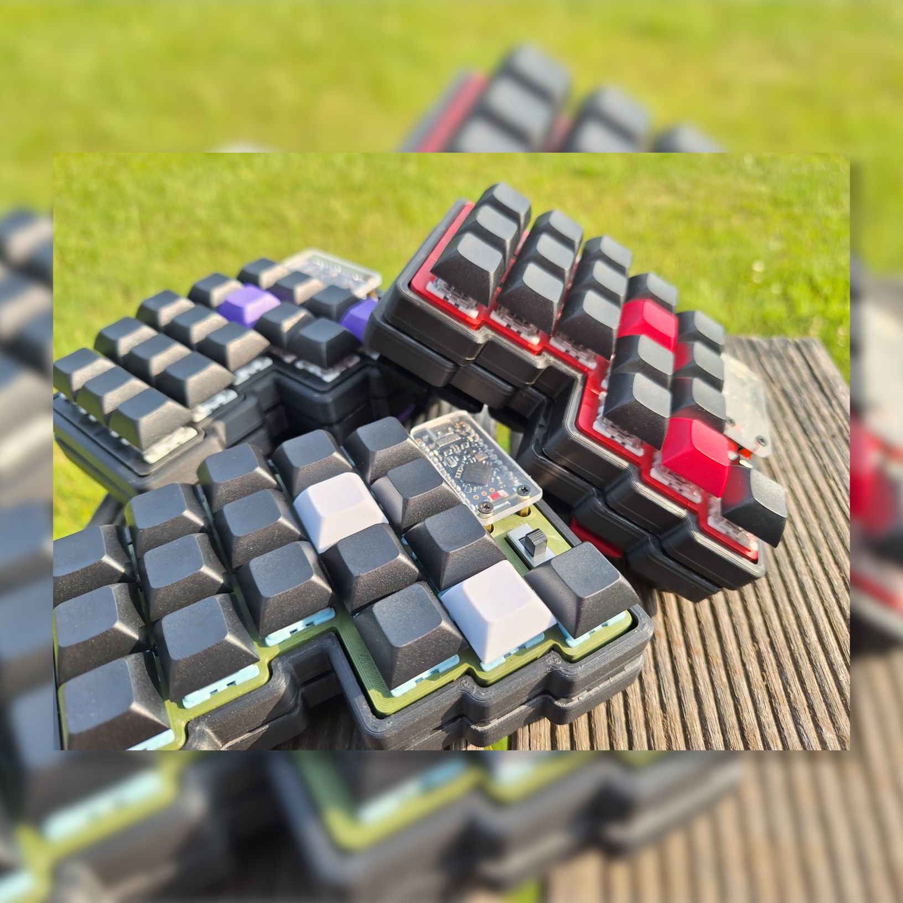
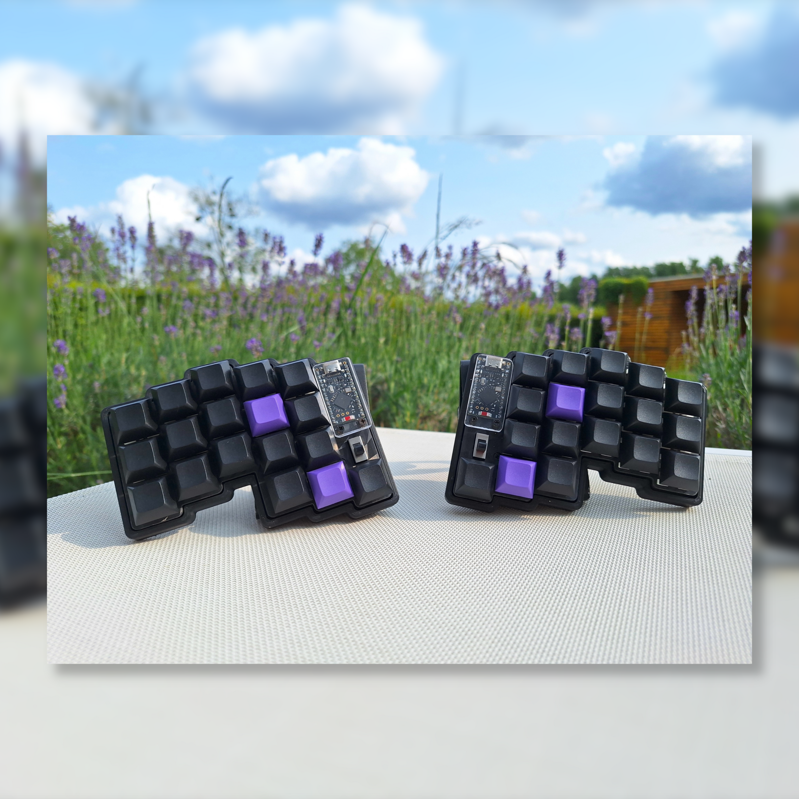
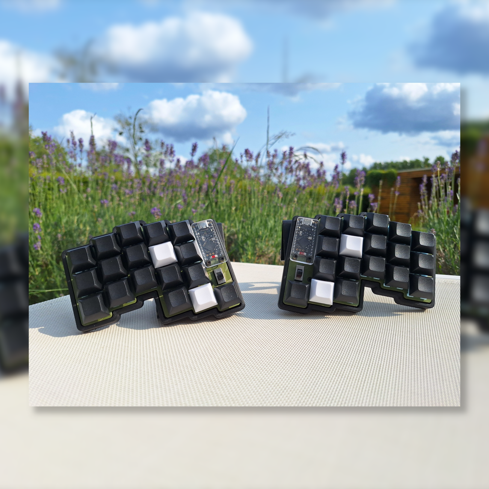
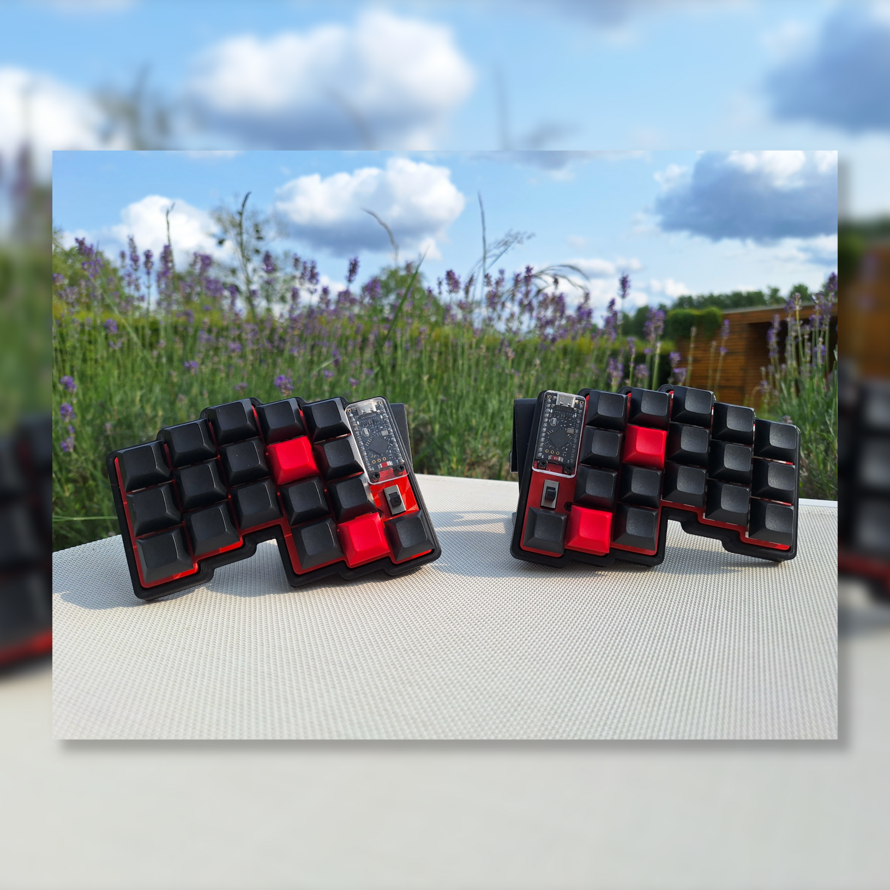
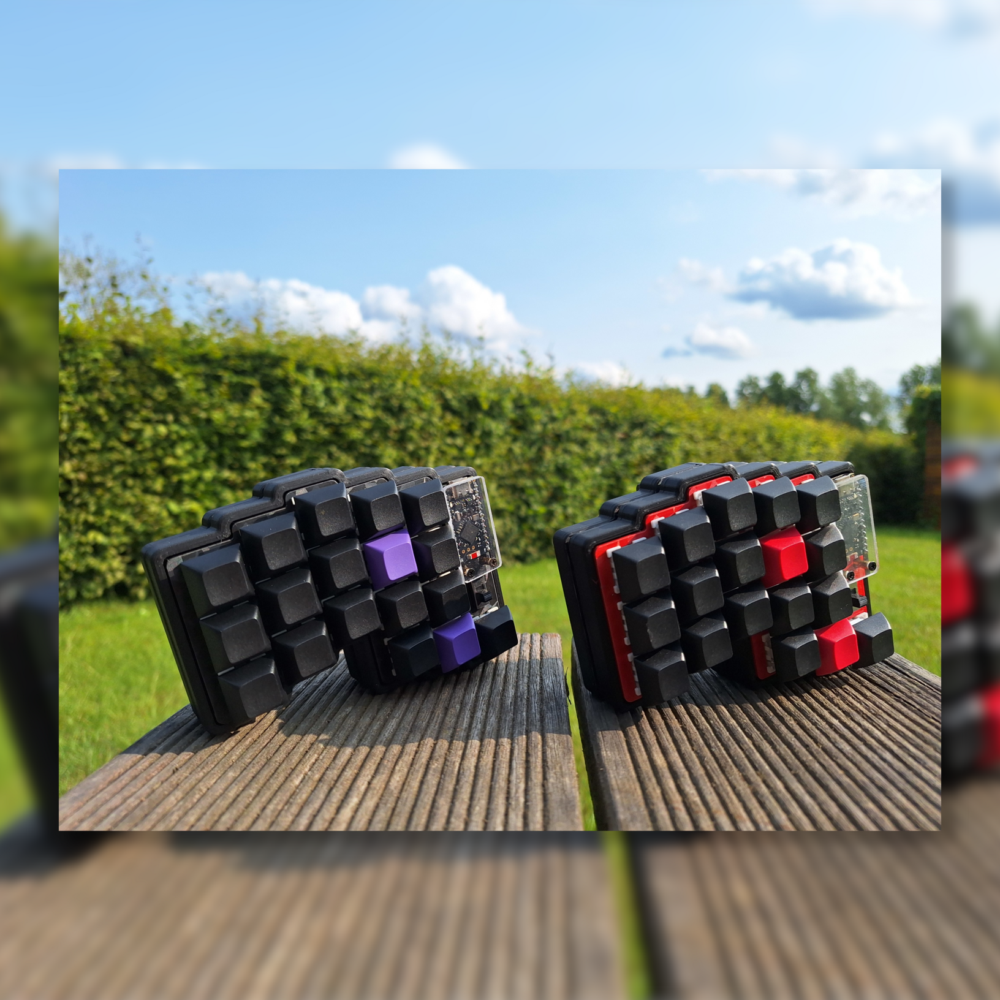

# ZMK-CONFIG-SPLIT 

This is a keyboard made with a pcb in a split layout with 36 keys and a promicro nrf52840 as the microcontroller.

zmk documentation: zmk.dev
todo: add picture of keyboard

# LAYOUT

There are by default 4 layers and 2 extra's if you want to add more in zmk studio:
* base 
* symbols
* navigation
* config

Documentation pdf can be found in the docs folder: [keymap_explained.pdf](https://github.com/lander03xD/zmk-config-split/blob/main/docs/keymap_explained.pdf).

# Building the keyboard

This section is just for you Glen! (do ask questions)

CAUTION:
* Diodes are directional.
* Left powerlines need to be corrected.
* Always test your progress with a multimeter. 

Order of doing things:
 
* **DIODES:**
* NOTE: I put the diodes on the bottom of the board so that I can easily fix one if they are broken at some point. Diodes are directional, so put them in the right orientation.
* Bend the diodes over the powerswitch. The powerswitch is the right width so that you can easily bend the legs and insert them in the keyboard later.
* Insert all diodes. CAUTION! Diodes are directional. You can see the flow the diode allows by checking the little black line on the diode. This line should point towards the bottom of the keyboard.
* I soldered the diodes on the bottom of the board. Flip the board and solder on the legs. 
* **HEADER PINS:**
* You need a row of 12 headerpins. Count them carefully. 
* Cut off the excess. You will need the spacer on the remaining pins to lift up the edges of the microcontroller. Pull the spacers of the remaining pins and slide em on the long end of the first and last pin you will use.
* Put the diode pins on the board, and solder 1 singular pin! Reflow the solder and make sure the headerpins are straight on the PCB. If both rows of header pins are connected with a single pin. You can test out the fit with the microcontroller. before soldering in the other pins. DON'T SOLDER THE MICROCONTROLLER YET.
* **POWER SWITCH**
* Solder in the powerswitch. Orionation doens't matter. Do solder in one leg before you reflow the solder to make sure it's straight on the board.
* **FIX POWER LINES**
* On the left hand side of the boards the powerlines are not correct. These need to be corrected manually.
* cut the line going from the 'GND' pad to one of the pins. Cut the line going from the middle pin on the powerswitch to the microcontroller pin. See picture for reference.
* prepare 2 lengths of wire. Red is positive, black is gnd. solder on the back of the board.
* black: from the 'gnd' pad to the third pin on the right side. 
* red: from the middle pin on the powerswitch to the top pin on the left. 
* **BATTERY**
* pretin the battery pads
* disconnect the powerswitch. (down is 'off', up is 'on')
* solder the black wire of the battery to the 'gnd' pad, and the red wire to the 'B+' pad.
* **FIRMWARE**
* flashing the firmware. 
* connect the microcontroller to the pc. Short the 'gnd' and 'rst' pins (third and fourth pin on the right side) (acts as a reset button) swiftly twice. (check pinout : https://holykeebs.com/cdn/shop/files/Supermini-nRF52840-Pinout.webp )
* The orange led should start blinking and a drive should open on the computer. Drop the firmware in this drive and let it do it's thing. The led should stop blinking when the firmware is uploaded.
* Upload the left firmware to the left microcontroller, and the right to the right.
* **MCU**
* put the MCU on the headerpins on top of the battery. 
* solder in the pins. (Good luck) 
* **SWITCHES** 
* put the plate on the pcb and plop in your switches. 
* solder them on the board. 
* **TESTING**
* Connect the left side to the pc. Press some keys. Call me for debugging. 
* **DISAPPOINT**
* put on your filthy printed keycaps
* make my desappointed 
* **CASE**
* Print the case
* Put in the threaded inserts: 
* Clean up the holes in the printed case. 
* Put the threaded inserts in from the outside of the board (from the top for the plate, and the bottom for the case)
* Get your soldering iron and set it to 150-160C (should be enough to make pla moldable)
* push in the threaded insert with the soldering iron and press it flat with something else so it's very straight.
* **SCREWS AND STANDOFFS**
* Near the microcontroller there are 2 holes. Push some short screws in there and tighten a spacer on top.
* Put the acrylic cover on top and tighten with the other short screws.
* The long screws go through the threaded inserts all the way through the threaded inserts in the case. Press the keyboard down properly while screwing in the big boys. 

* **DONE**
 

